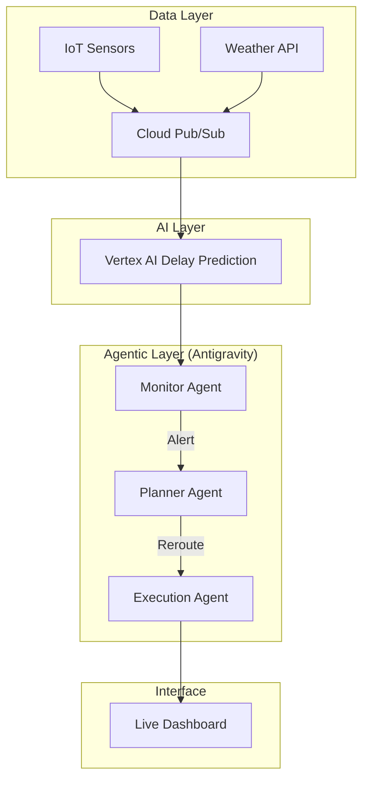

# 🛰️ Smart Supply Chain: Autonomous Control Prototype

## 🌟 Overview
This project is a **Smart Supply Chain** prototype developed for the **Solution Challenge**. It demonstrates how AI can transform global logistics from reactive to proactive. By combining **Vertex AI**'s predictive power with **Antigravity AI Agents**, the system autonomously detects potential shipping delays and reroutes shipments in real-time to mitigate risks.

### 🎯 Key Problem
Global supply chains are often disrupted by unpredictable weather, traffic, and port congestion. Traditional systems only alert managers *after* a delay occurs. Our solution predicts these delays before they happen and takes autonomous action.

---

## 🛠️ Technology Stack
- **Frontend**: Vanilla JavaScript, HTML5, CSS3 (Glassmorphism design).
- **AI/ML**: Vertex AI (Predictive Analytics Schema).
- **Agentic Logic**: Antigravity Multi-Agent Orchestration (Python).
- **Infrastructure**: Google Cloud Platform (GCP) Architecture, GitHub Actions CI/CD.

---

## 🏗️ Architecture
The system operates in a closed-loop "Observe-Orient-Decide-Act" (OODA) cycle:

1.  **Observe**: IoT sensors (simulated) stream GPS, weather, and traffic data.
2.  **Orient**: **Vertex AI** analyzes the data to calculate a "Delay Probability Score."
3.  **Decide**: The **Antigravity Monitor Agent** triggers the **Planner Agent** if the risk exceeds 60%.
4.  **Act**: The **Execution Agent** commits a rerouting plan to the logistics system and updates the live dashboard.



---

## 🚀 Getting Started

### 1. Local Dashboard
The easiest way to see the prototype in action is to open the local dashboard:
- Open `index.html` in any modern web browser.
- Click **"Simulate Weather Incident"** to trigger the agentic loop.

### 2. Running Python Agents
To run the core logic in your terminal:
```bash
# Navigate to the project
cd smart-supply-chain

# Run the agent orchestrator
python src/agents/agent_orchestrator.py
```

### 3. IoT Simulator
To see live data generation:
```bash
python src/data_ingestion.py
```

---

## 📦 Project Structure
```text
├── .github/workflows/    # CI/CD Deployment pipeline
├── src/
│   ├── agents/           # Antigravity Agent implementations
│   │   └── agent_orchestrator.py
│   └── data_ingestion.py # IoT and Vertex AI simulator
├── docs/
│   └── delay_prediction_schema.json # AI Model definition
├── index.html            # Main Dashboard
├── style.css             # Premium Styling
├── app.js                # Dashboard Logic & Simulation
├── implementation_plan.md # Technical Design Document
└── walkthrough.md        # Feature Breakdown
```

---

## deployed demo

link:  https://solution-challange-tawny.vercel.app/


## 🌐 Deployment to GitHub Pages


---

## 🤖 Agent Logic Details
- **Monitor Agent**: Constantly listens for "High Risk" events. It uses a threshold-based logic to avoid noise.
- **Planner Agent**: Evaluates alternative routes (e.g., bypassing storm zones or traffic jams) using Google Maps Route Optimization logic.
- **Execution Agent**: Simulated "write" operations to an ERP system to finalize the reroute.

---

## 🤝 Contribution
Developed for the Solution Challenge by niyati10000.
Powered by **Antigravity AI**.
