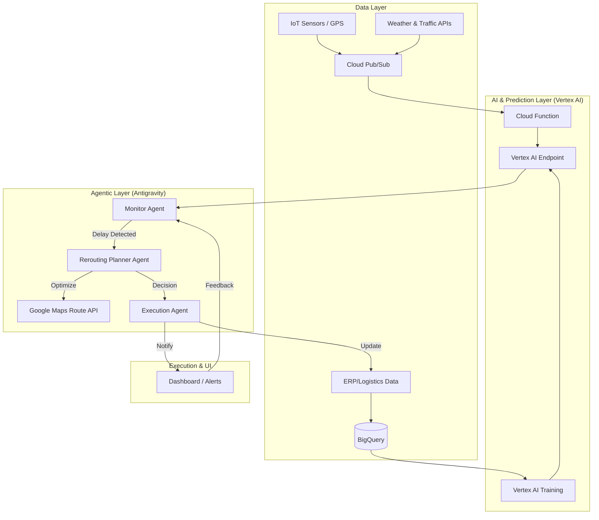

# Smart Supply Chain Prototype Implementation Plan

This plan outlines the architecture and implementation steps for a Smart Supply Chain system. The system leverages **Vertex AI** for predictive analytics (delay prediction) and **Antigravity Agents** for autonomous decision-making and rerouting.

## Architecture Overview

The system follows a reactive, agent-driven architecture where real-time data triggers AI predictions, which are then handled by specialized agents to mitigate risks.

## Proposed Components

### 1. Delay Prediction (Vertex AI)
- **Model**: A regression model trained on historical shipping data, weather patterns, and port congestion levels.
- **Deployment**: Deployed on Vertex AI Endpoints for low-latency inference.
- **Input**: Current coordinates, carrier ID, weather conditions, estimated time of arrival (ETA).
- **Output**: Probability of delay and estimated delay duration.

### 2. Autonomous Rerouting (Antigravity Agents)
The system utilizes a multi-agent orchestration pattern:
- **Monitor Agent**: Continuously polls or receives webhooks from the Vertex AI endpoint. It triggers an alert if the delay probability exceeds a threshold (e.g., >70%).
- **Rerouting Planner Agent**: Analyzes the specific cause of delay. It interacts with the **Google Maps Route Optimization API** to find faster alternatives or different logistics hubs.
- **Execution Agent**: Simulated agent that performs the "commit" action—updating the carrier's route or switching to a backup courier.

### 3. Data Pipeline
- **Google Cloud Pub/Sub**: Handles streaming ingestion of IoT and GPS data.
- **BigQuery**: Acts as the data warehouse for historical analysis and model retraining.

---

## Proposed Changes

### [Component Name] AI Model & Data Pipeline

#### [NEW] [delay_prediction_schema.json](file:///C:/Users/DELL/.gemini/antigravity/scratch/smart-supply-chain/docs/delay_prediction_schema.json)
- Define the input features required for the Vertex AI model.

#### [NEW] [data_ingestion.py](file:///C:/Users/DELL/.gemini/antigravity/scratch/smart-supply-chain/src/data_ingestion.py)
- Script to simulate IoT data flow into Pub/Sub.

### [Component Name] Antigravity Agents

#### [NEW] [agent_orchestrator.py](file:///C:/Users/DELL/.gemini/antigravity/scratch/smart-supply-chain/src/agents/agent_orchestrator.py)
- The main logic for coordinating between the Monitor, Planner, and Executor agents.

#### [NEW] [rerouting_logic.py](file:///C:/Users/DELL/.gemini/antigravity/scratch/smart-supply-chain/src/agents/rerouting_logic.py)
- Integration with Route Optimization APIs.

---

## Verification Plan

### Automated Tests
- **Simulation**: Run a test script that injects "Heavy Rain" and "High Traffic" data to trigger a delay prediction >80%.
- **Agent Validation**: Verify that the Planner Agent successfully identifies a route that is at least 15% faster than the delayed route.

### Manual Verification
- Review the dashboard logs to ensure agent reasoning is transparent (showing *why* a specific reroute was chosen).
