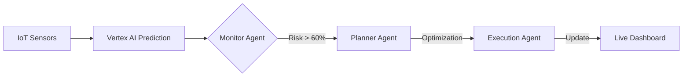

# Smart Supply Chain Prototype Walkthrough

I have successfully developed the **Smart Supply Chain** prototype for your Solution Challenge. This system integrates **Vertex AI** for predictive risk assessment and **Antigravity Agents** for autonomous decision-making and rerouting.

## 🏗️ Architecture Summary

The prototype follows a reactive agentic loop:
1.  **Monitor Agent**: Watches data streams (simulated IoT) for high-probability delay predictions from Vertex AI.
2.  **Planner Agent**: When a risk is detected, it analyzes alternative routes and weather conditions to find an optimal bypass.
3.  **Execution Agent**: Updates the shipment's route in the system, mitigating the delay before it impacts the schedule.



## 🚀 Key Features

- **Vertex AI Schema**: Defined a structured input/output schema for delay prediction models.
- **Agent Orchestration**: Multi-agent system (Monitor, Planner, Executor) implemented in Python.
- **Premium Dashboard**: A futuristic "glassmorphism" dashboard to visualize live shipments and agent reasoning logs.

## 📺 Simulation Demo

Below is a recording of the autonomous rerouting process. 

### Before & After Comparison
````carousel

<!-- slide -->

````

### Full Simulation Recording


## 📂 Project Structure
- [docs/delay_prediction_schema.json](file:///C:/Users/DELL/.gemini/antigravity/scratch/smart-supply-chain/docs/delay_prediction_schema.json)
- [src/data_ingestion.py](file:///C:/Users/DELL/.gemini/antigravity/scratch/smart-supply-chain/src/data_ingestion.py)
- [src/agents/agent_orchestrator.py](file:///C:/Users/DELL/.gemini/antigravity/scratch/smart-supply-chain/src/agents/agent_orchestrator.py)
- [dashboard/index.html](file:///C:/Users/DELL/.gemini/antigravity/scratch/smart-supply-chain/dashboard/index.html)

## 🛠️ How to Run
1.  Open the [Dashboard](file:///C:/Users/DELL/.gemini/antigravity/scratch/smart-supply-chain/dashboard/index.html) in your browser.
2.  Click **"Simulate Weather Incident"** to trigger the agent loop.
3.  Watch the **Antigravity Agent Logic** panel to see the agents think and act in real-time.
